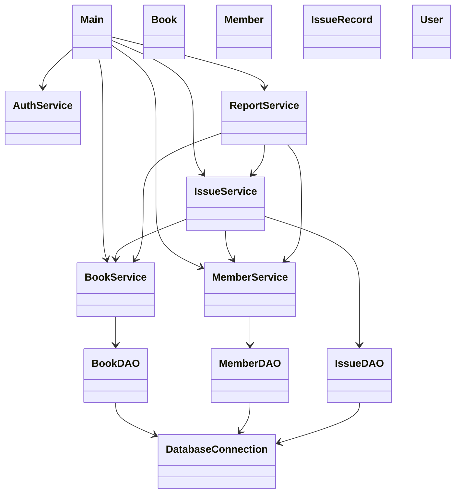

# Class Diagram

```mermaid
classDiagram
class Main
class AuthService
class BookService
class MemberService
class IssueService
class ReportService
class BookDAO
class MemberDAO
class IssueDAO
class Book
class Member
class IssueRecord
class User
class DatabaseConnection
Main --> AuthService
Main --> BookService
Main --> MemberService
Main --> IssueService
Main --> ReportService
BookService --> BookDAO
MemberService --> MemberDAO
IssueService --> IssueDAO
IssueService --> BookService
IssueService --> MemberService
ReportService --> BookService
ReportService --> MemberService
ReportService --> IssueService
BookDAO --> DatabaseConnection
MemberDAO --> DatabaseConnection
IssueDAO --> DatabaseConnection
```