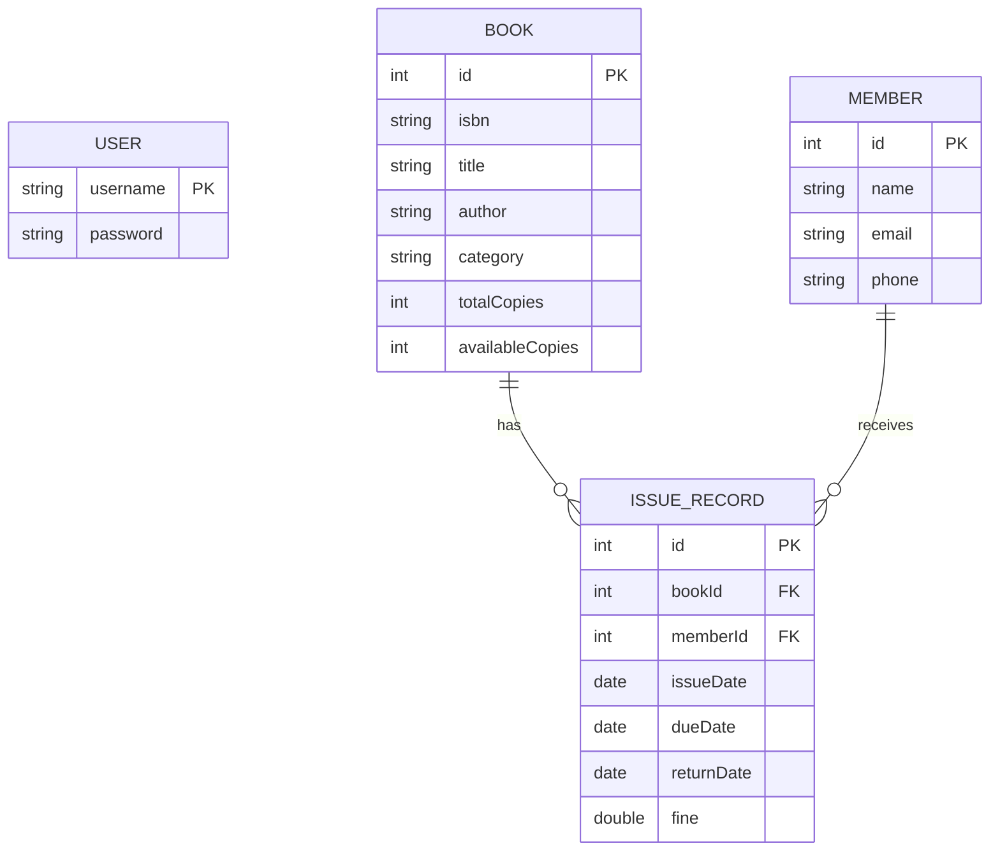

# Data Model Diagram

The application uses a Java-serialized local store containing four logical collections.

```mermaid
erDiagram
    USER { string username PK string password }
    BOOK { int id PK string isbn string title string author string category int totalCopies int availableCopies }
    MEMBER { int id PK string name string email string phone }
    ISSUE_RECORD { int id PK int bookId FK int memberId FK date issueDate date dueDate date returnDate double fine }
    BOOK ||--o{ ISSUE_RECORD : has
    MEMBER ||--o{ ISSUE_RECORD : receives
```