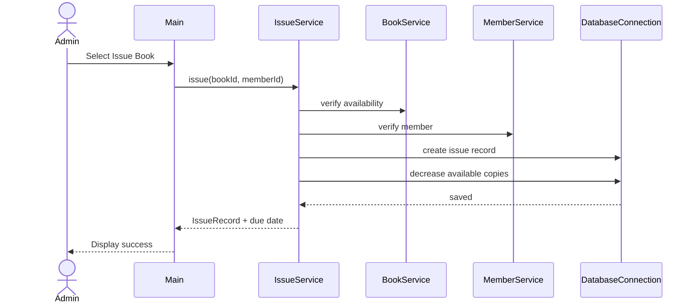

# Issue Book Sequence

```mermaid
sequenceDiagram
    actor Admin
    participant CLI as Main
    participant Service as IssueService
    participant Book as BookService
    participant Member as MemberService
    participant Store as DatabaseConnection
    Admin->>CLI: Select Issue Book
    CLI->>Service: issue(bookId, memberId)
    Service->>Book: verify availability
    Service->>Member: verify member
    Service->>Store: create issue record
    Service->>Store: decrease available copies
    Store-->>Service: saved
    Service-->>CLI: IssueRecord + due date
    CLI-->>Admin: Display success
```