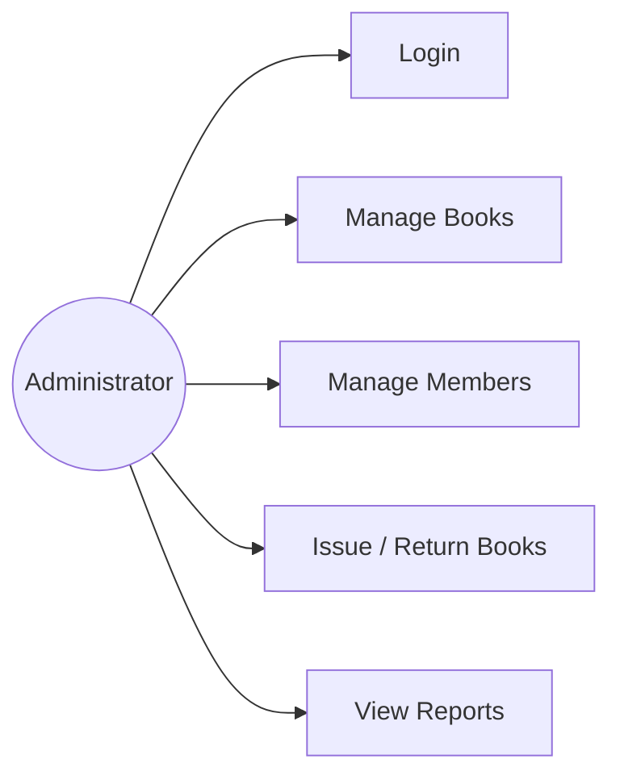

# Use-Case Diagram

```mermaid
flowchart LR
    Admin((Administrator)) --> Login[Login]
    Admin --> Books[Manage Books]
    Admin --> Members[Manage Members]
    Admin --> Issue[Issue / Return Books]
    Admin --> Reports[View Reports]
```

The administrator is the primary actor for the current CLI system.